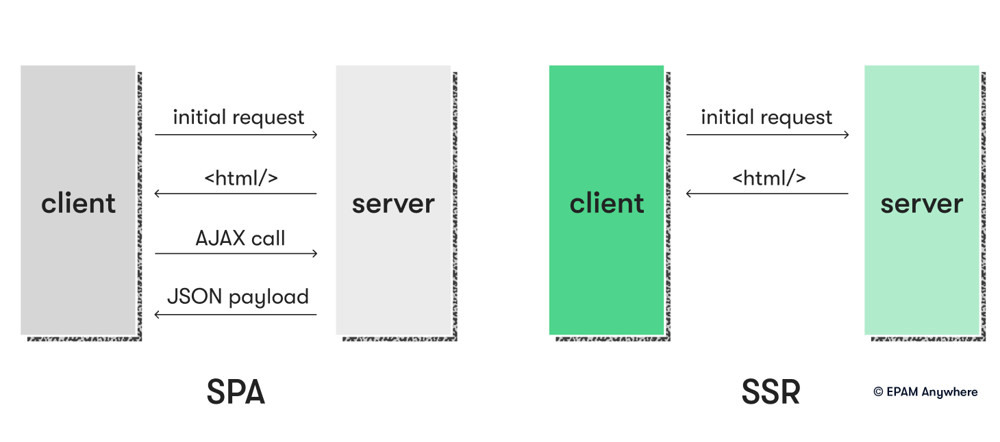

# Front End Questions

- \***\*What is a CDN?\*\***
  A content delivery network (CDN) is a system for delivering content to users based on geographic location. CDNs can deliver websites, software applications, and other types of digital content.
- \***\*What is AJAX?\*\***
  AJAX is a web development technique for creating asynchronous web applications. AJAX allows you to create dynamic, responsive web applications that can be updated without reloading the page.
- \***\*What are the different types of CSS selectors?\*\***
  There are several types of CSS selectors, including class selectors, ID selectors, and attribute selectors
- \***\*What is a pseudo-class?\*\***
  A pseudo-class is a selector that styles an element based on its state. For example, the :hover pseudo-class styles an element when the user hovers over it with their mouse but does nothing when they don't.
- \***\*What is a CSS reset?\*\***
  A CSS reset is a set of rules applied to all browsers to normalize the default styling of HTML elements. It’s particularly useful when stripping the formatting of HTML elements.
- \***\*What is a CSS preprocessor?\*\***
- \***\*What are the main differences between SPA and SSR?\*\***
  
  - SEO: SPA has worse SEO than SSR
  - Development: generally easier in SPA since all in client side vs more server side dev and config for SSR
  - Scalability: SPA easier horizontal scale by adding more servers. SSR requires more powerful servers to handle HTML rendering
  - Security: SPA more vulnerable to XSS, SSR more secure since on server side
  - Offline Functionality: SPA better offline b/c of cache. SSR requires network connection
- \***\*Describe the life cycle of any task in front end development\*\***
  Generally follows these stages:
  1. Requirement gathering: get requirements from stake holders.
  2. Planning: Breaking down task to smaller tasks.
  3. Design: includes things like wireframes, mocks, prototypes
  4. Development: writing code
  5. Testing
  6. Deployment
  7. Maintenance
- \***\*Explain the sense of using several .env files. What types of environments do you know?\*\***
  Common practice to manage different env vars required by app. These are dynamic values set outside the code and config files to customize the app for different environments. Dev, Test/Stage, Production.
- \***\*How would you optimize a website's performance?\*\***
  Minify code.
  Cache where possible.
  CDN for media.
  reduce number of requests. (combine things like css and js files)
  lazy loading (asynch requests)
  Optimize media sizes. Mobile first code.
- **Describe experience with debugging and techniques for debugging.**
  1. Browser developer tools
  2. console logging
  3. breakpoints
  4. testing
  5. code review
  6. error log/log tracing
- \***\*Can you describe the process for developing a user interface from scratch?\*\***
  1. define user requirements
  2. sketch layout
  3. design visual elements
  4. develop ui
  5. test ui
  6. iterate and improve
  7. launch
- **Can you explain the concept of the Document Object Model (DOM)?**
  The DOM is an in-memory, tree-like representation of the structure of an HTML document. It allows JavaScript to interact with and manipulate the elements on the page.
- **How do you ensure cross-browser compatibility for your applications?**
  - feature detection (used to see if browser can handle modern functionality)
  - progressive enhancement (provide baseline essential content and functionality to as many as possible, and deliver best experience to users with more modern browsers)
  - graceful degradation techniques (build towards modern browsers first)
- **\*\***\*\*\*\***\*\***New features in HTML5?**\*\***\*\*\*\***\*\***
  - semantic tags like <header>, <footer>, <article>, and <section>
  - multimedia elements like <video> and <audio>
  - new input types
  - canvas for 2D drawing
  - APIs like Geolocation, Web Storage, and Web Workers
- **What is Webpack, and what role does it play in frontend development?**
  Webpack is a popular module bundler and build tool for frontend applications. It enables developers to bundle JavaScript files, stylesheets, and other assets into a single output file, optimizing load time and performance. Webpack also provides features like code splitting, lazy loading, and hot module replacement.
- **What is the purpose of Babel in modern frontend development?**
  Babel is a JavaScript transpiler that allows developers to write modern JavaScript code (ES6+) and convert it into a version that is compatible with older browsers. It helps ensure cross-browser compatibility and allows developers to leverage the latest language features.
- **Can you explain the concept of progressive web apps (PWAs)?**
  Progressive web apps (PWAs) are web applications that use modern web technologies to provide a native app-like experience for users. They offer features like offline support, push notifications, and installability, making them a more engaging and reliable option for certain use cases.
- **How do you ensure accessibility in your frontend applications?**
  - follow the Web Content Accessibility Guidelines (WCAG)
  - semantic HTML
  - ARIA attributes
  - ensure proper contrast ratios
  - test using screen readers and other assistive tools
- **What are some best practices for writing maintainable and scalable frontend code?**
  Some best practices include using modular and component-based architecture, following established coding standards and style guides, writing clear and concise comments, using meaningful variable and function names, implementing unit and integration tests, and leveraging tools like linters and formatters to enforce consistency.
- **What is continuous integration and continuous deployment (CI/CD), and why is it important for frontend development?**
  CI/CD is a set of practices that automate the process of building, testing, and deploying code. Continuous integration ensures code changes are frequently integrated and tested, while continuous deployment automates the deployment of tested code to production. It is important for frontend development because it reduces manual intervention, increases deployment speed, and helps catch issues early.
- **How do you handle browser caching for frontend applications?**
  I handle browser caching by setting appropriate cache-control headers, using ETags, and leveraging long-term caching for static assets with fingerprinting (adding unique hashes to file names)
  Leverage things like webpack top optimize build sizes for better cach efficiency
- **What are some common performance bottlenecks in frontend applications, and how do you address them?**
  unoptimized images: fix with optimized images
  render-blocking resources: defer or asynch load non critical resources
  excessive DOM manipulation: minimize DOM manipulations
  inefficient js: use things like throttle or debounce
- **How do you ensure that your code is secure and prevents common security vulnerabilities like XSS and CSRF?**
  follow secure coding practices:
  - validate and sanitize user input
  - use prepared db queries
  - encode data before rendering to DOM
  - make use of security features in FE libraries (React has safeties built in)
- **Can you explain the concept of web components and their benefits?**
  Web components are a set of web platform APIs that enable developers to create custom, reusable HTML elements. They promote modularity, encapsulation, and interoperability, allowing for more maintainable and scalable frontend applications.
- **How do you approach optimizing the critical rendering path in web applications?**
  Minimize the time to render initial content
  - inline critical CSS
  - defer non-critical CSS and JS
  - using async and defer
  - optimize web font
  - reduce server response time
- **Can you explain the concept of component libraries and their benefits in frontend development?**
  A collection of pre-built UI components to be re-used across projects. Help speed up dev, maintain design systems, and consistent ux across apps
- **What are some key considerations when working with third-party libraries or APIs in frontend development?**
  - checking documentation
  - community support
  - compatibility with project
  - performance impact
  - security
  - maintainability
  - license
- **What is the role of WebSockets in frontend development?**
  WebSockets provide a full-duplex communication channel between the client and the server, enabling real-time data exchange and reducing latency. They are used in frontend development for applications that require real-time updates, such as chat applications, notifications, or live data feeds.
- **Can you explain the concept of server push in the context of HTTP/2?**
  Allows the server to proactively send resources to client’s cache before explicitly requested. can help reduce perceived load time.
- **How do you handle user authentication and authorization in frontend applications?**
  Use secure protocols like OAuth 2.0 or OpenID Connect, using JSON Web Tokens for stateless auth, managing user perms on client side
- **What are some benefits of using a monorepo for frontend development?**
  Monorepos provide a single repository for managing multiple projects, promoting code sharing, versioning, and dependency management. They can improve collaboration, streamline the development process, and ensure a consistent architecture and codebase across multiple applications.
- **How do you approach form validation in frontend applications?**
  HTML5 form validations, JS validation, server side validation, and visual feedback for errors.
- **Can you explain the concept of a single-page application (SPA)?**
  An app that loads one single HTML page and dynamically updates content as user interacts with app. Minimize full page reloads and leverage client side rendering
- **What is the role of lazy loading in frontend development?**
  defer loading of less critical resources to improve initial load time and performance.
