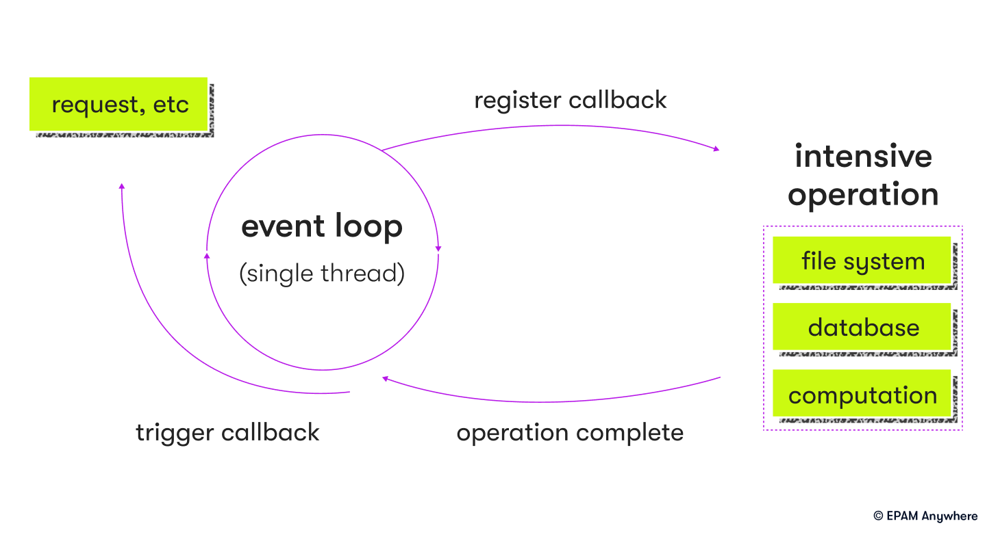

# JS Specific Questions

- **What is event delegation in JavaScript?**
  Event delegation is a technique where a single event listener is attached to a parent element to handle events for its child elements. It takes advantage of event bubbling and reduces the number of event listeners needed, improving performance.
- **Can you explain the difference between var, let, and const in JavaScript?**
  'var' has function scope and is hoisted to the top of the function. 'let' and 'const' are block-scoped, and are not hoisted. 'const' is used for variables with values that should not change, while 'let' is used for variables with values that can change.
- **What are arrow functions and how do they differ from regular functions?**
  Arrow functions are a shorthand to write functions.
  No arguments object that you normally get in regular functions.
  best used for certain cases like callbacks or in functions like array functions.
- ************\*\*\*\*************\*\*************\*\*\*\*************Explain JavaScript event loop************\*\*\*\*************\*\*************\*\*\*\*************
  the JS event allows JS to handle asynchronous events like user input and network requests, while keeping single threaded execution
  1. event loop continuously checks for new events in event queue
  2. when event is added to queue a priority and type is assigned
  3. event loop takes highest priority in queue
  4. callback functions can add more events to the queue
  5. once callback is finished event loops moves to next in queue
     
- **What are closures in JavaScript, and why are they important?**
  Closures are functions that have access to their own scope, the scope of the outer function, and the global scope. They are important because they allow for data encapsulation, enabling private variables and providing a way to maintain state between function calls.
- **Explain the concept of "hoisting" in JavaScript.**
  Hoisting is a mechanism in JavaScript where variable and function declarations are moved to the top of their containing scope during the compilation phase. It allows variables and functions to be used before they are declared in the code.
- **What is the difference between == and === in JavaScript?**
  ==: loose equality and coerces to same type
  ===: strict equality type and value
- **What are promises in JavaScript? How do they compare to async/await?**
  Promises are a way to handle asynchronous operations in JavaScript, providing a cleaner and more readable approach than callbacks. They represent a value that may be available in the future. Async/await is built on top of promises, allowing asynchronous code to be written in a synchronous-looking manner, making it even more readable and easier to reason about.
- **Explain the concept of prototypal inheritance in JavaScript.**
  Prototypal inheritance is a mechanism in JavaScript where objects inherit properties and methods from other objects (called prototypes) instead of classes. It enables code reuse and inheritance without the need for class-based structures.
- **What are JavaScript modules, and how do you use them?**
  JavaScript modules are a way to encapsulate and organize code, allowing developers to split their code into separate files and manage dependencies. Modules can be imported and exported using the 'import' and 'export' keywords, making it easier to maintain and reuse code across projects.
- **What are React hooks, and what problem do they solve?**
  React hooks are functions that allow functional components to manage state and access lifecycle events and other React features previously exclusive to class components. They solve the problem of code reuse and logic sharing between components, making it easier to write and maintain complex applications.
- **What is the purpose of the Redux library, and how does it work with React?**
  Redux is a state management library used to manage the global application state in a predictable and consistent manner. It works with React by providing a centralized store for the state, which can be accessed and updated by components through actions and reducers.
- **What are the key principles of Redux?**
  The key principles of Redux are a single source of truth (one global store), state is read-only (state can only be changed by dispatching actions), and changes are made using pure functions (reducers) that take the current state and an action to return a new state.
- **Can you explain the role of actions, reducers, and the store in Redux?**
  Actions are objects that describe what happened in the application and carry a payload of information. Reducers are pure functions that determine how the state should change based on the dispatched action. The store is a single object that holds the entire application state and provides methods to access and update the state.
- **What are some common techniques for optimizing images in web applications?**
  Some common techniques include using the appropriate image format (e.g., JPEG, PNG, SVG, or WebP), compressing images to reduce file size, serving responsive images using the 'srcset' attribute or 'picture' element, and leveraging lazy loading to defer the loading of off-screen images.
